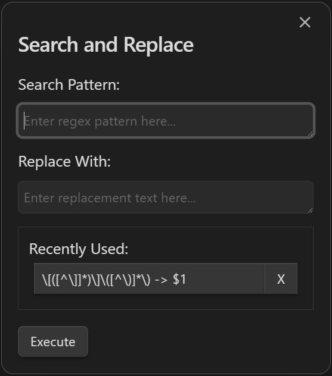

# Search and Replace Plugin

## Overview

The **Search and Replace Plugin** enhances Obsidian's text manipulation capabilities by allowing users to perform advanced **search and replace operations** using **regular expressions**. This plugin is designed to streamline workflows by making complex text replacements effortless while maintaining a record of previous regex-replace pairs for easy reuse.



Use **CMD+SHIFT+H** OR **CTRL+SHIFT+H** to open the plugin's interface.

## Features

-   **Search and Replace with Regex**: Perform precise text manipulation using regular expressions.
-   **History of Regex-Replacement Pairs**: Automatically saves recently used patterns and replacements for quick access.
-   **Manage History**: Delete unused entries from the recently used list directly within the plugin interface.
-   **Hotkey Support**: Access search-and-replace functionality with customizable keyboard shortcuts.

## Manual Installation

1. Clone or download this repository into the `.obsidian/plugins/` folder of your Obsidian vault.
2. Navigate to the plugin folder using your terminal:
    ```bash
    cd path/to/your/vault/.obsidian/plugins/search-replace-plugin
    ```
3. Install dependencies:
    ```bash
    npm install
    ```
4. Build the plugin:
    ```bash
    npm run dev
    ```
5. Enable the plugin:
    - Open **Settings** in Obsidian.
    - Navigate to **Community plugins** and enable **Search and Replace Plugin**.

## Usage

1. Open the plugin's interface:

    - Use the hotkey **Ctrl+Shift+H** (or **Cmd+Shift+H** on macOS), or select the **Search and Replace** command from the Command Palette.

2. Enter your search pattern (regex) and replacement text in the modal.
3. Access recently used regex-replacement pairs from the scrollable list to reuse or modify them.
4. Click "Execute" to apply the search and replace operation.
5. Manage your history by deleting entries you no longer need.

## Configuration

Customize the plugin settings:

1. Open **Search and Replace Settings** under Obsidian's settings menu.
2. Set the maximum number of regex-replacement pairs to retain in the history.

## Development

### Prerequisites

-   Node.js and npm installed on your system.
-   An Obsidian vault for plugin development.

### Developer Commands

-   **Install Dependencies**: `npm install`
-   **Run Development Server**: `npm run dev`
-   **Build for Production**: `npm run build`

## Contribution

Contributions are welcome! Submit pull requests for new features, bug fixes, or enhancements.

## License

This plugin is open-source and distributed under the MIT License.
